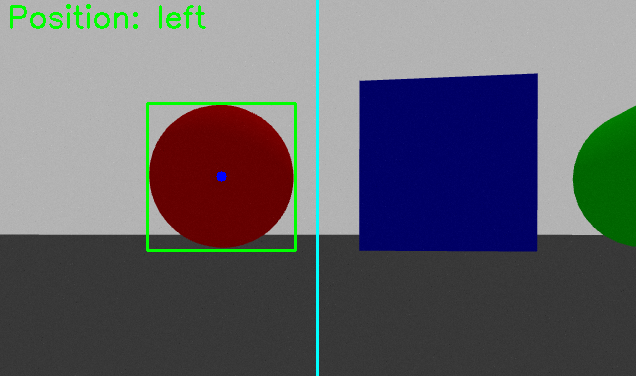
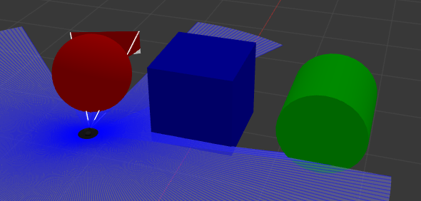

# Vision Steering
A simple package for ROS which makes TurtleBot3 move towards red objects in a Gazebo simulation. The robot will turn left or right to keep red objects in the center of its view. This project was built to gain hands-on experience with ROS2, Gazebo, image-based perception, and simple closed-loop robot control.

The vision_steering package uses OpenCV to find red objects in view.

TurtleBot will stop to avoid colision.

# Installation

Follow the installation guides for [TurtleBot3](https://emanual.robotis.com/docs/en/platform/turtlebot3/quick-start/#pc-setup), [ROS 2 Humble](https://docs.ros.org/en/humble/Installation/Ubuntu-Install-Debs.html), and [Gazebo Fortress](https://gazebosim.org/docs/fortress/ros_installation/), then clone this repository into your workspace's src directory and run `colcon build`. Tested with Ubuntu 22.04.

# To Start
Navigate to your workspace and run `ros2 launch vision_steering shapes.launch.py`