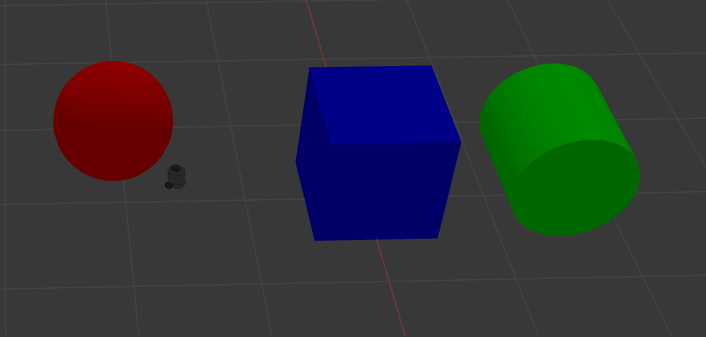
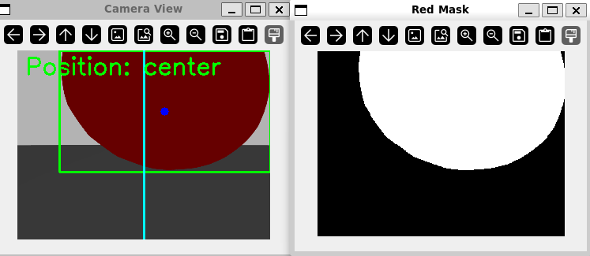

# Vision Steering
A simple package for ROS which makes TurtleBot3 move towards red objects in a Gazebo simulation. The robot will turn left or right to keep red objects in the center of its view.

# Installation

Follow the installation guides for [TurtleBot3](https://emanual.robotis.com/docs/en/platform/turtlebot3/quick-start/#pc-setup), [ROS 2 Humble](https://docs.ros.org/en/humble/Installation/Ubuntu-Install-Debs.html), and [Gazebo Fortress](https://gazebosim.org/docs/fortress/ros_installation/), then clone this repository into your workspace's src directory and run `colcon build`. Tested with Ubuntu 22.04.